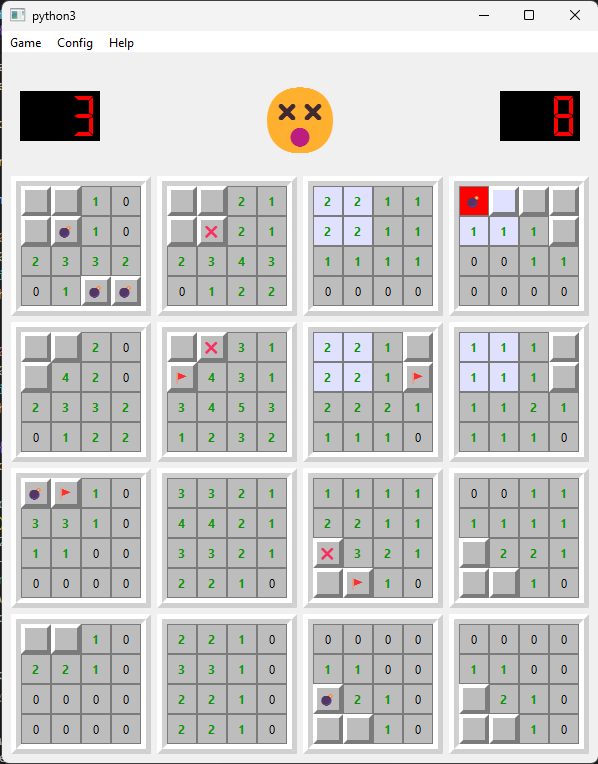

# Minesweeper 4D

Minesweeper 4D is a four-dimensional version of the classic Minesweeper game, where players must uncover hidden mines while avoiding detonating them. This version extends the concept to four dimensions, adding an extra dimension of complexity and strategy.

## Features

- **4D Gameplay**: Dive into a unique gaming experience by exploring a 4D space filled with mines and flags.
- **Intuitive User Interface**: User-friendly interface designed with Qt for a smooth and enjoyable gaming experience.
- **Various Difficulty Levels**: Choose from multiple difficulty levels to challenge your skills.
- **Customizable Settings**: Customize the game settings to suit your preferences and play style.

## Screenshots

*User interface of the Minesweeper 4D game.*

## Installation

1. Make sure you have Python installed on your system.
2. Install dependencies by running `pip install -r requirements.txt`.
3. Launch the game by running `python main.py`.

## Usage

- Use the left and right mouse buttons to dig and place flags respectively.
- Click on the menu to access game options and settings.

## Contributing

Contributions are welcome! If you'd like to contribute to this project, please follow these steps:

1. Fork the repository.
2. Create a new branch (`git checkout -b feature/improvement`).
3. Commit your changes (`git commit -am 'Add feature/improvement'`).
4. Push to the branch (`git push origin feature/improvement`).
5. Create a new Pull Request.

## Authors

- [MaxChevalier](https://github.com/MaxChevalier/)

## License

This project is licensed under the MIT License - see the [LICENSE](LICENSE) file for details.